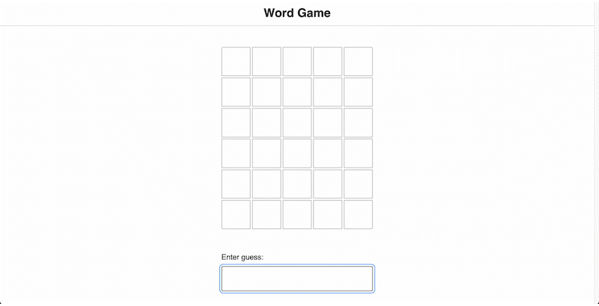

# Word Game

This is a recreation of the Wordle game.

It's my solution to the first project from "The Joy of React" course. Forked from  https://github.com/joy-of-react/project-wordle (see for the original instructions).

## Live Site
https://wordle-ten-xi.vercel.app/

## How to play

You have 6 attempts to guess a 5-letter word. You will get feedback with each attempt: Green boxes have correct letters, gray boxes have incorrect letters, yellow boxes have misplaced letters.

## Demo

